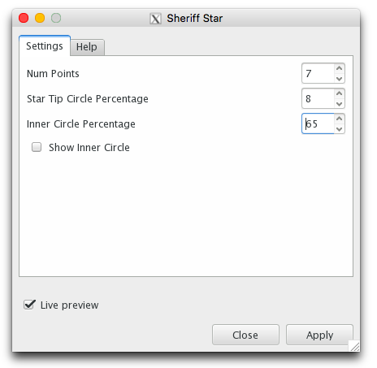
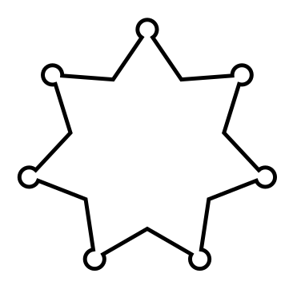

# PathMonkey

A collection of extensions for manipulating paths in Inkscape.

### Installing

Copy the .py and .inx files from `extensions` into your Inkscape extensions
directory (typically `~/.config/inkscape/extensions`).
See http://wiki.inkscape.org/wiki/index.php/Script_extensions#Installing.

## Sheriff Stars

Sheriff stars typically have 5 or 6 points and also have a circle at the end
of each point so that the badge can't accidentally stab the officer when
wearing the badge.

<table><tr>
<td colspan="5">6-pointed Sheriff Stars</td>
</tr><tr>
<td></td>
<td></td>
<td></td>
<td></td>
<td></td>
</tr><tr>
<td>Create and select a circle</td>
<td>Launch extension and set options</td>
<td>Shapes created by extension</td>
<td>Remove original circle</td>
<td>Union the shapes</td>
</tr></table>

<table><tr>
<td colspan="4">5- and 7-pointed Sheriff Stars</td>
</tr><tr>
<td></td>
<td></td>
<td></td>
<td></td>
</tr><tr>
<td></td>
<td></td>
<td></td>
<td></td>
</tr></table>

If the "Show inner circle" option is selected, then a circle touching the
inner points of the star will be included in the output. Here is an example
for a 5-pointed star:

## X-agrams

## Mutual Cut Line
