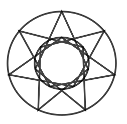
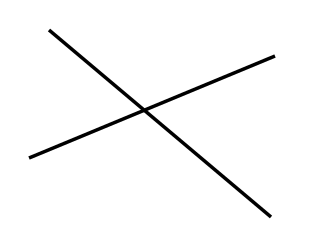

# PathMonkey

A collection of extensions for manipulating paths in Inkscape.

### Installing

Copy the .py and .inx files from `extensions` into your Inkscape extensions
directory (typically `~/.config/inkscape/extensions`).
See http://wiki.inkscape.org/wiki/index.php/Script_extensions#Installing.

## Sheriff Stars

Sheriff stars typically have 5 or 6 points and also have a circle at the end
of each point so that the badge can't accidentally stab the officer when
wearing the badge.

<table><tr>
<td colspan="5">6-pointed Sheriff Stars</td>
</tr><tr>
<td></td>
<td></td>
<td></td>
<td></td>
<td></td>
</tr><tr>
<td>Create and select a circle</td>
<td>Launch extension and set options</td>
<td>Shapes created by extension</td>
<td>Remove original circle</td>
<td>Union the shapes</td>
</tr></table>

<table><tr>
<td colspan="4">5- and 7-pointed Sheriff Stars</td>
</tr><tr>
<td></td>
<td></td>
<td></td>
<td></td>
</tr><tr>
<td></td>
<td></td>
<td></td>
<td></td>
</tr></table>

If the "Show inner circle" option is selected, then a circle touching the
inner points of the star will be included in the output. Here is an example
for a 5-pointed star:

## X-agrams

X-agrams are stars with a circumscribed circle. While these can be drawn
separately, it can be tricky to properly align the circle and the star,
especially for odd-count stars where the center of the star's bounding box
is not the center of the star.

<table><tr>
<td colspan="4">Pentagram (5-agram)</td>
</tr><tr>
<td></td>
<td></td>
<td></td>
<td></td>
</tr><tr>
<td>Create and select a circle</td>
<td>Launch extension and set options</td>
<td>Basic pentagram (vertex skip=2)</td>
<td>Vertex skip = 1</td>
</tr></table>

<table><tr>
<td colspan="3">Septagram (7-agram)</td>
</tr><tr>
<td></td>
<td></td>
<td></td>
</tr><tr>
<td>Vertex skip = 1</td>
<td>Vertex skip = 2</td>
<td>Vertex skip = 3</td>
</tr></table>

In addition to connecting each point along the outer circle, they can also be
connected via an inner circle.

<table><tr>
<td colspan="4">Septagram (7-agram) with inner connection</td>
</tr><tr>
<td></td>
<td></td>
<td></td>
<td></td>
</tr><tr>
<td>Vertex skip = 1</td>
<td>Vertex skip = 2</td>
<td>Vertex skip = 3</td>
<td>Vertex skip = 4</td>
</tr></table>

## Mutual Cut Line

Even though Inkscape has a Cut operation, I never seem to be able to remember
which line will cut and which one is doing the cutting. Also, sometimes I
want them to cut each other and keep all the segments.

Given 2 lines that intersect:

This will generate the 4 segments where they divide each other:

Note that this leaves the original lines in place, so you'll need to delete
them if you no longer want them around:

